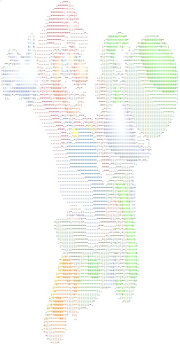

# ASCII Art Generator



ASCII art generator provides a command-line interface (CLI) that allows you to generate simple ASCII art from a BMP image file. The generated ASCII art is either printed on the CLI or saved into a text file/html file.

## Installation

1. Clone the repository:

   ```shell
   git clone https://github.com/hanjihun2000/ascii-art-generator.git
   ```

2. Navigate to the project directory:

   ```shell
   cd ascii-art-generator
   ```

## Usage

To generate ASCII art from a BMP image file, follow these steps:

1. Prepare a BMP image file in the desired location.

2. Open a command prompt or terminal.

3. Navigate to the project directory:

   ```shell
   cd path\to\ascii-art-generator
   ```

4. Compile the code using g++ compiler. If you don't have gcc or g++ compiler on your device, please follow the download instruction [here](https://gcc.gnu.org/) or other package managers to download the compiler.

    ```shell
    g++ -o your-executable.exe ascii.cpp bmp.cpp
    ```

5. Run the generated executable file with the path to the BMP image file:

   ```shell
   .\your-execuatable.exe [args]
   ```
   
   ### Notes:
   - your-executable.exe is a program executable file you generated after the compilation.
   - args include geration type <s|p>, full path name to BMP image you want to generate <image.bmp>, width and height limit <limit width, limit height>, and full path name to the ascii art output <output.txt|output.html>.
   - Replace `path\to\image.bmp` with the actual path to your BMP image file.

6. After running the command, the generated ASCII art will be saved in a text file.

## Compilation

The code for this project is written in a mix of C and C++. It is compiled using the `g++` compiler. The version used for compilation is `g++.exe (Rev6, Built by MSYS2 project) 13.1.0`.

## ASCII Character Mapping

The ASCII art generator uses the following 8 ASCII characters for mapping different shades of the BMP image:

- '@'
- '#'
- '%'
- '*'
- '|'
- '-'
- '.'
- ' '

These characters are used to represent increasing levels of darkness, with '@' being the darkest and ' ' being the lightest.

## Examples

Here is an example of generated ASCII art:

```
                .--.                              
              .---##*                             
             .---|%**|                            
            .-----*@#|                            
           ..--------...         .                
       .@- ..----.......     .%%###-   .-*%*|.    
       -@-....... .** ..    .*%##%##  -%%##%%%%   
  %#|  *@*....-||%%%%*.     -**%@@@@*|*%%#####%%  
  |%#@##@@....*%#%#@#%-     -|*%@@@|****%%#####%* 
.*%#@@@@@@*-..|#@-|@##@#.   -||**|@-||**%%%#####%-
*%##@@@@@@#*-.-##|*%*#@@|   .||*..@*|||**%%%####%*
*###@@@@@@@%*.|#* ..*%%#.  |||||| %||||***%%%%#%%*
|%##%%####@|***%%-   ||.  .|--||#%*|||||****%%%%%*
.%%|*%%%*%|--|*%%%*--..-  .|--|*%%||||||||*****%%*
 .   .-*%|.---|**%%.--%.   --||*%%|-|||||||******|
       .-...---|**%*|%|     .-*@@@#||||||||||****.
          ....---|*%%*.    .-*#@@@@#|||||||||||*| 
           ....--.----.----|-%#@@@@#*|||||||||||  
            ....-..-%|--|%--|%%#@@@#%--||||||||   
             ....---#%----.-|%%##@@##| .-||||.    
              ...---------.|-*%%#####%-..-        
               ...---------*||*%%######*|*.       
               ....--------||-|**%%%%%%##%        
                ...-------- ----|*****- .         
                .....------. --..-|||.            
                .......-----.  .---||-            
                .........---- .-*%*|*|            
                 .........-----|*%#%**            
                 .........---||||%#%**            
                   ... ...----|*%%###%            
                   -......---|****%##%            
                  |##%%|...---|||-*##*            
               ||--|||--....---.-**%#|            
               -||||----.......||-|%#*            
                |||||---.....-|-|--*#%            
                -||||----..---|**||*##.           
                 ||-----|-|--||***-*##-           
                 %%|--|*%%*||||%*||%##|           
                *%%%*||*%%%%*|%%*-|%##|           
               .%*%%%*|**%%%*|%%|-|*%%|           
               ***%*%%******|*#%%%-|*%-           
               %*************#%-|%-||*            
              *********|||||    .%%||-            
             .%%%**|**||||-      .-|-             
             **%%%|||||-.                         
            .%*%%%|.|-                            
            ||****.                               
            *|****                                
            .|||*-                                
             .||-                                 
```

## Contributing

Contributions are welcome! If you'd like to contribute to this project, please follow these steps:

1. Fork the repository.

2. Create a new branch:

   ```shell
   git checkout -b your-new-branch
   ```

3. Make your changes and commit them:

   ```shell
   git commit -m "Add your commit message here"
   ```

4. Push your changes to your forked repository:

   ```shell
   git push origin your-new-branch
   ```

5. Create a pull request on the original repository.

## Acknowledgments

```
I declare that the assignment here submitted is original except for source material explicitly acknowledged. I also acknowledge that I am aware of University policy and regulations on honesty in academic work, and of the disciplinary guidelines and procedures applicable to breaches of such policy and regulations, as contained in the website http://www.cuhk.edu.hk/policy/academichonesty/.

--

Name : HAN, Jihun
Email Addr : 1155128719@link.cuhk.edu.hk
```

- For education use only.

- Thank you to all the contributors who have helped make this project better.